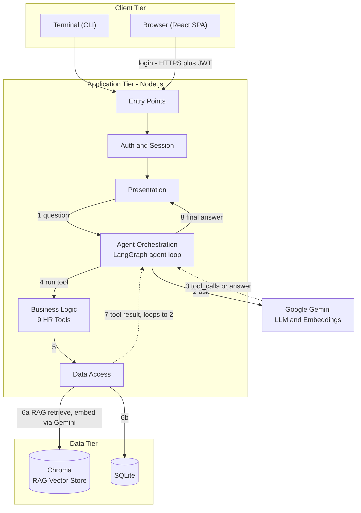

# HR Chat Agent

An HR chat agent built with LangChain JS and Google Gemini, developed step by step.

## Demo

<video src="demo/hr-chat-agent-demo.mp4" controls width="720"></video>

[Watch the demo video](demo/hr-chat-agent-demo.mp4) (captions: [demo/hr-chat-agent-demo.captions.srt](demo/hr-chat-agent-demo.captions.srt)) - the architecture first (diagram walkthrough), then the live app: traditional sidebar tabs through to light mode, the chat agent in full mode, a happy path (a leave date-range calculation that excludes a weekend and a public holiday, a context-aware follow-up extending that range, a database-backed balance check in the same conversation, and a maternity-leave policy question answered with a RAG citation), and two negative paths (a cross-employee data request declined, and a leave request exceeding the available balance correctly declined).

## Architecture

### Diagram



At a higher level, the LLM's actual job in this architecture is narrower than it might first appear - employee data, policy retrieval and date/eligibility math are each delegated to a dedicated subsystem, leaving the model to understand the question and orchestrate between them:

```text
                     LLM
                      │
              Understand + orchestrate
                      │
         ┌────────────┼─────────────┐
         ↓            ↓             ↓
       SQLite       Chroma      Business tools
         ↓            ↓             ↓
       Facts        Policy      Calculations
```

Three tiers: the **Client Tier** (the CLI terminal and the React browser UI, both just different ways to reach the same backend), the **Application Tier** (a Node.js process - `server.js` for the web API or `index.js` for the CLI - layered top to bottom: entry point, auth/session, presentation, agent orchestration, business logic, data access, each layer only talking to the one below it), and the **Data Tier** (SQLite for structured HR data, Chroma for the policy document's vector embeddings), with Google Gemini as the one external service for both the chat model and embeddings. The login path (Terminal/Browser through Entry Points, Auth and Session, to Presentation) happens once per session; the numbered edges (1-8) are the turn-by-turn loop that repeats for every question.

| Diagram node | Real file(s) |
|---|---|
| Entry Points | `server.js`, `index.js` |
| Auth and Session | `src/session.js`, `src/server/auth.js` |
| Presentation | `src/server/routes.js`, `src/chat.js` |
| Agent Orchestration | `src/agent.js` |
| Business Logic | `src/tools/index.js` |
| Data Access | `src/db/repository.js`, `src/rag/index.js` |

The numbered edges are not incidental - they are the actual order of execution for one turn, including the loop. Take a policy question like "how many days of earned leave carry forward to next year?": (1) Presentation sends the question to Orchestration, which (2) asks Gemini. Gemini's reply comes back as (3) `tool_calls or answer` - here, a call to `search_hr_policy` - so Orchestration sends (4) `run tool` into Business Logic, which (5) calls Data Access. Data Access (6a) retrieves against Chroma, embedding the query via Gemini first, or (6b) reads SQLite directly, depending on which tool ran. The result returns as (7) a dotted `tool result` loop back to Orchestration - which may repeat from (2), asking Gemini again, if the question needs another tool (the same LangGraph cycle step 6's `check_leave_eligibility` relies on when it needs balance, policy and date-calculation results together). Only once the model stops requesting tools does Orchestration send (8) the final answer back to Presentation, citing the policy page.

### Framework choices

Each choice below names what that tool specializes in relative to its alternatives, why that specialization matches this project's actual workload, and the honest trade-off where one exists.

- **Node.js/JavaScript end-to-end** - Node specializes in event-driven, non-blocking I/O: orchestrating many concurrent external calls (LLM requests, database reads, vector search) rather than CPU-bound local computation. An HR chat agent's actual workload is exactly that shape - waiting on API responses and tool calls, never running inference locally - which is Node's specialized niche, not Python's (Python specializes in the numeric/ML-training workloads this project never does locally). Running one language across frontend and backend also means the same validation schemas (the `zod` schemas each tool already declares) could, in principle, be shared directly between client and server, with no serialization boundary between two different type systems. Trade-off: Python's LangChain/AI-tooling ecosystem is broader and more mature than its JavaScript counterpart - the reason most agent tutorials default to it - accepted here in exchange for a single-language, single-runtime stack.
- **LangChain JS + LangGraph** - LangChain specializes in a standardized tool/function-calling interface across LLM providers; LangGraph specializes specifically in agentic control flow as an explicit graph (conditional branches, loops) rather than a one-shot linear chain. This HR agent needs exactly that: multi-step tool orchestration that continues or stops based on what the model decides mid-conversation (balance lookup, then eligibility check, then policy citation), which is LangGraph's specialized niche, not a simple single-pass prompt/response.
- **Google Gemini** - Flash-tier Gemini specializes in low-latency, cost-efficient tool-calling with a large context window, from the same vendor that also provides the embeddings model used for RAG. An HR assistant's workload is many small, frequent tool-calling exchanges within one conversation - exactly the speed/cost profile Flash-tier models are built for, as opposed to a frontier/reasoning-tier model specialized for fewer, deeper, more expensive completions this workload doesn't need. Using one vendor for both chat and embeddings also keeps the embedding space consistent - embeddings from different providers aren't directly comparable, so mixing them would mean reconciling two incompatible vector spaces for no benefit here.
- **RAG (retrieval-augmented generation)** - specializes in grounding answers in a source document at query time, as opposed to fine-tuning (which bakes knowledge into model weights, expensive to update and prone to silently stale answers) or stuffing the whole policy into every prompt's context (works until the document outgrows the context window, and pays its full token cost on every single turn regardless of relevance). The HR policy here changes independently of the model and needs a citable source page in the answer - RAG's specialization (retrieve only the relevant passage, on demand, with its source) fits that directly; the other two approaches solve problems (baking in static knowledge, or guaranteeing every token is visible) this use case doesn't have.
- **Chroma** - specializes in embeddable, local-first vector search with minimal setup, as opposed to managed/distributed vector databases (Pinecone, Weaviate) that specialize in massive multi-tenant scale. This project's RAG corpus is one small policy document, a few dozen chunks, single-tenant - exactly Chroma's specialized sweet spot; a distributed vector DB's specialization (huge scale, many tenants) would be solving a problem this use case doesn't have. Trade-off: it runs as a single local process here, no clustering/replication/backup - fine at this scale, a real limit for multi-user production.
- **`node:sqlite`** - specializes in embedded, zero-configuration, single-file storage optimized for read-heavy, low-concurrency access, as opposed to Postgres/MySQL's specialization in high-concurrency multi-client server workloads. This project's HR data (a handful of employees, mostly read traffic - balance/profile lookups - infrequent writes) is precisely that profile. Trade-off: SQLite's single-writer model is the real ceiling - fine for the seeded employee set here, something a real multi-user production system would migrate off of.
- **Express + JWT** - Express specializes in minimal, unopinionated HTTP routing without an enforced architecture, fitting a handful of endpoints rather than needing a heavier full-stack framework's scaffolding. JWT specializes in stateless, self-contained identity - verifiable without a shared session store - which fits an API meant to stay horizontally scalable (no central session store required; `AsyncLocalStorage` resolves identity per-request, in-process). Already genuinely production-appropriate, as the concurrency test demonstrated - no trade-off to accept here.
- **React + TypeScript + Vite** - React specializes in component-based, stateful interactive UIs, fitting the dashboard's non-trivial client state (chat history, FAB/drawer/full modes, multiple live data cards) better than simpler templating built for mostly-static pages. TypeScript specializes in catching type errors at compile time, valuable given the API response shapes flowing through this state. Vite specializes in fast, minimal-config dev tooling for a single-page app - fitting this project better than a heavier meta-framework (e.g. Next.js) whose specialization (server-side rendering, file-based routing) this single-page dashboard doesn't use.

#### Why this model: Gemini Flash

The model was evaluated against this HR agent's actual requirements rather than by simply picking the largest model available. The evaluation criteria were reliable tool-calling, instruction-following, RAG-grounded response generation, context handling, latency, cost, and integration with this project's Node.js/LangChain stack. As the Architecture section's diagram above shows, facts, policy and calculations are each handled by a dedicated tool rather than the model itself, so the LLM's role is primarily orchestration and response generation - exactly the profile a low-latency Flash-tier model is built for, as opposed to a frontier/reasoning-tier model specialized for deeper, more expensive completions this workload doesn't need.

| Capability | Rating |
|---|---|
| Tool-calling reliability | ★★★★★ |
| Instruction following | ★★★★★ |
| RAG / grounded answering | ★★★★★ |
| Latency | ★★★★☆ |
| Structured output | ★★★★☆ |
| Context handling | ★★★★☆ |
| Privacy/security | ★★★★★ |
| Cost | ★★★★☆ |
| Raw advanced reasoning | ★★★☆☆ |
| Multimodal capability | ★☆☆☆☆ |

Privacy/security scores highest because it matters most for a real HR production system: every tool takes its employee ID from the session, never as a model-supplied argument (see "Tools" below), so there's no prompt-level trust in the LLM to get another employee's data right or wrong.

### Tools

| Tool | Purpose | Reads from |
|---|---|---|
| `get_leave_balance` | Casual/Sick/Earned/Privilege leave balance for the authenticated employee | SQLite |
| `calculate_leave_days` | Working days between two dates, excluding weekends and public holidays | SQLite (holidays) |
| `search_hr_policy` | Retrieves the most relevant passages across all 4 policy PDFs (leave, benefits, staff loan, WFH), cited by document and page | Chroma (RAG) |
| `get_employee_profile` | Name, department, date of joining, employment status | SQLite |
| `get_holidays` | The company's public holiday list | SQLite |
| `check_leave_eligibility` | Combines employment status, balance and working-day count into one eligibility verdict | SQLite |
| `check_wfh_eligibility` | Tenure-based work-from-home/hybrid eligibility verdict, plus the day quota | SQLite |
| `check_loan_eligibility` | Combines tenure, CTC cap, active-loan and repayment-gap checks into one staff-loan eligibility verdict | SQLite |
| `submit_leave_request` | Submits a leave request, auto-approved and the balance deducted immediately once the employee explicitly confirms | SQLite |

Every tool takes its employee ID from the session, never as a model-supplied argument - the model has no parameter through which it could ask for another employee's data. `submit_leave_request` is the only tool that writes rather than reads: it takes a `confirmed` argument the model may only set to `true` after the employee has explicitly confirmed the exact request in chat - never on the first ask.

### Implementation approach

Built incrementally, one concept per step (see the step-by-step log below), each step committed and tested before the next began. Claims were verified empirically rather than assumed: step 6's `check_leave_eligibility` tool was only added after measuring the model getting a real eligibility question wrong in 2 of 5 identical runs without it; step 8's `AsyncLocalStorage` session fix was verified by firing 20 real concurrent requests across two different logged-in employees and confirming zero cross-talk; the UI's markdown rendering and dashboard layout were verified with actual rendered screenshots, not just a successful build. The sections below are that build log, in order.

## Step 1: one agent, one tool

`index.js` gives the LLM a single tool, `get_leave_balance`, and runs one tool-calling round:

```text
User question → LLM decides whether a tool is needed → app runs the tool
             → tool result goes back to the LLM → final answer
```

No `if (question.includes("leave"))` routing: the model chooses the tool from its name, description and schema.

## Step 2: multiple tools and an agent loop

`index.js` now has three tools: `get_leave_balance` (fixed to return CL/SL/EL, matching the real policy), `calculate_leave_days` (counts working days in a date range, weekends excluded), and `search_hr_policy` (a stubbed keyword search over a few policy snippets — real document search/RAG comes in a later step).

The fixed two-round shape from step 1 became a loop, since a question can need more than one tool, possibly one after another:

```text
User question → LLM decides which tool(s), if any, are needed
             → app runs each requested tool, feeds results back
             → LLM decides again: call more tools, or answer
             → ...repeats until no more tool calls → final answer
```

Tools are looked up from a `name → tool` map, so adding one is a one-line change instead of a new `if` branch.

Tested behavior:
- A compound question ("I want to take casual leave from Oct 12–16, do I have enough balance, and what's the CL policy?") makes the model call all three tools in the same turn, then correctly reason that 5 working days needed > 4.5 CL available, so the answer is "not enough".
- Plain tool and no-tool questions from step 1 still work.

**Note on free-tier rate limits:** the Google AI free tier allows only 20 requests/day per model. If you see a `429` quota error, either wait for the daily reset or point `GEMINI_MODEL` at a different model (for example `gemini-3.5-flash-lite`), which has its own separate quota.

## Step 3: context handling

An LLM call has no memory of its own — the only thing it "knows" is whatever is in the `messages` array sent with that call. Steps 1–2 rebuilt that array from scratch for a single question each run, so there was nothing to follow up on.

`index.js` now has two modes:
- **`node index.js "question"`** — unchanged single-shot mode from steps 1–2, still handy for quick, scripted tests.
- **`node index.js`** (no argument) — an interactive chat. It keeps one `messages` array for the whole session: each turn's question and answer (and any tool calls in between) stay in that array, so later turns can refer back to earlier ones. Type `exit` or `quit` to end the session.

The tool-calling loop from step 2 (ask → run tools → ask again until no more tool calls) is unchanged; it's now wrapped in a `runAgentTurn(messages)` function that both modes call, once per turn.

Tested behavior (interactive mode):
```text
You: What is my casual leave balance?
HR Agent: Your current casual leave balance is 4.5 days.

You: What about sick leave?
HR Agent: Your current sick leave balance is 6 days.
```
"What about sick leave?" is ambiguous on its own - about the balance? the policy? something else? Because the earlier turn is still in `messages`, the model resolves it as a follow-up to the balance question, without the user having to repeat "what is my ... balance".

## Step 4: a real database, and code organized into layers

Through step 3, every tool returned hardcoded data, and all the code lived in one `index.js`. That was fine for three small functions, but a database brings its own concerns (schema, seeding, queries) that don't belong mixed into the model/CLI code. So this step does two things together: adds SQLite, and splits the code into layers, each only talking to the one below it:

```text
index.js            entry point: single-shot vs interactive, nothing else
src/chat.js          presentation: the two CLI modes (readline)
src/agent.js         orchestration: the model, bindTools, the runAgentTurn loop
src/tools/index.js   business logic: the 5 tool definitions
src/db/              data access: schema, seed data, connection, queries
```

The database uses `node:sqlite`, built into Node.js - no new dependency, same reasoning as step 3's `readline`. `src/db/connection.js` creates `data/hr.sqlite` on first run, applies `schema.sql`, and seeds it from `src/db/seed.js` (only if empty, so re-running never duplicates data). `data/` is gitignored - the database is cheap to rebuild from code, so a fresh clone just works with `npm install`.

What changed:
- `get_leave_balance` now queries the `leave_balances` table instead of returning hardcoded JSON.
- `calculate_leave_days` now excludes public holidays (from the `holidays` table) as well as weekends.
- Two new tools: `get_employee_profile` and `get_holidays`.
- Seeded data: 3 fictitious employees (richer data for later steps - no new tool uses EMP002/EMP003 yet), their leave balances, a few sample `leave_history` rows (not read by any tool yet, but seeded now to avoid a schema change later), and all 12 holidays from `docs/policies/holiday-list-2026.pdf`.

Tested behavior:
- `calculate_leave_days` on a range that includes Ayudha Poojai (Monday 19-Oct-2026, a weekday holiday) now correctly returns 5 working days for Oct 12–19, not 6 - proof the holiday list is actually being excluded, not just weekends.
- `get_employee_profile` and `get_holidays` both work as expected; `get_leave_balance` gives the same numbers as before, now from the database.
- Interactive mode (step 3's context handling) still works unchanged after the restructure.

## Step 5: RAG over the real HR policy PDF

Through step 4, `search_hr_policy` was a stub: ~6 hardcoded snippets, keyword-matched. RAG (Retrieval-Augmented Generation) replaces that with real search over `docs/policies/leave-policy.pdf`:

```text
PDF → one Document per page
    → RecursiveCharacterTextSplitter (chunks, page number kept)
    → GoogleGenerativeAIEmbeddings (text → vector)
    → Chroma (stores vectors, finds the closest ones to a query)
```

At indexing time, each chunk is embedded and stored. At query time, the *question* is embedded the same way, and the stored chunks whose vectors are closest ("most similar in meaning") are retrieved and handed to the model - so the model answers from real retrieved text, not a guess, and cites the page it came from.

This is the first step with an external process dependency: **Chroma runs as a separate local server**, not embedded in the Node process. Start it once before running the app:

```bash
npx chroma run --path ./data/chroma   # start once, leave running
node index.js "..."                    # in another terminal, as before
```

`src/rag/` does the indexing (`ensureIndexed()`, automatic on first run, same "fresh clone just works" idea as step 4's database) and retrieval (`retrieve(query, k)`), written directly against `pdf-parse` and the `chromadb` client rather than `@langchain/community`'s `PDFLoader`/`Chroma` wrappers - that package was deprecated/sunset by the LangChain team while building this step, with no replacement package yet, so this avoids depending on something already announced as unmaintained. `@langchain/textsplitters` and `@langchain/google-genai`'s embeddings are still used directly, unaffected by that deprecation.

Citations are by **page number** (1–8), not a named section - the natural unit the pipeline works with, more robust than hand-parsing heading text out of extracted PDF output.

Tested behavior: asked one question per policy area and checked the retrieved page and the final answer against the real PDF text:
- "Can I carry forward my casual leave?" → page 6 (the FAQ), correctly: no.
- "How does PL to EL conversion work with 11 days?" → page 3, correctly reproduces the policy's own worked example (7 retained, 4 converted → 2 EL).
- "What is the maternity leave policy for adoption?" → page 5, accurate summary.
- Stopping the Chroma server produces a clear "start it first: `npx chroma run ...`" message, not a raw stack trace.
- Interactive mode (step 3) still works: a DB-backed question, then a RAG follow-up ("Can *that* be carried forward?") that depends on the earlier turn's context.

## Step 6: LangGraph, and a check_leave_eligibility tool

Through step 5, `runAgentTurn` was a hand-written loop: call the model, run any requested tools, call the model again, repeat until there are no more tool calls. LangGraph doesn't add new capability here - it gives that exact shape a name and an explicit structure: a **graph** of **nodes** (steps that transform state) connected by **edges** (what runs next):

```text
agent node   -> call the model (same as before)
tools node   -> run whatever tools were requested (same toolsByName lookup as before)
conditional edge after "agent": tool calls requested? -> tools   no more? -> END
edge "tools" -> "agent": closes the loop
```

The tool-running code in the `tools` node is still our own (not LangGraph's prebuilt `ToolNode`) - only the *control flow* moved from a loop to a graph; nothing about *how* tools run is hidden. `src/chat.js` didn't change at all: `runAgentTurn(messages)` kept its exact signature.

**New tool: `check_leave_eligibility`.** Before adding it, we tested whether the agent could already reason its way to a correct eligibility answer using just the existing tools (`get_employee_profile` + `get_leave_balance` + `calculate_leave_days`) - asking 5 times whether a `notice_period` employee (EMP003, seeded in step 4) could take casual leave they had enough balance for. **2 of 5 runs were wrong**: the model never called `get_employee_profile`, so it never learned about the notice-period restriction, and confidently said yes. The other 3 runs got it right - so the model *knows* the rule when it checks, it just doesn't reliably *think to* check. `check_leave_eligibility` makes that check unconditional: it looks up employment status, blocks CL/SL/EL/PL outright if the employee is on notice period (regardless of balance, per policy), otherwise compares the requested working days against the real balance - deterministic every time, not dependent on the model remembering to look something up.

Tested behavior:
- The same EMP003 question, repeated: now correctly "not eligible, serving notice period" every time.
- A within-balance request for the authenticated employee: correctly "eligible."
- An over-balance request: correctly "not eligible," citing the exact shortfall.
- The model picks `check_leave_eligibility` on its own for eligibility-shaped questions ("do I have enough balance for X"), and still combines it with `search_hr_policy`/`calculate_leave_days` when a question also asks about policy or day counts.
- Steps 1–5's existing questions (single-tool, 3-tool compound, RAG, interactive context handling) all still work unchanged through the new graph.

## Step 7: authentication - the employee ID comes from the session, never the LLM

Through step 6, every self-service tool (`get_leave_balance`, `get_employee_profile`, `check_leave_eligibility`) took `employeeId` as a **model-supplied argument** - and the LLM will dutifully look up whatever ID the conversation gives it, as step 6's `EMP003` testing already showed. The problem isn't the prompt wording; it's that `employeeId` was a tool *argument* at all - every argument is something the model chooses, and nothing enforced "you may only ever act on your own ID." The fix: remove `employeeId` from those tools' schemas entirely. The ID now comes from `src/session.js`, set once at login and read directly by tools - the model has no parameter left through which to even attempt supplying a different one.

**Login**: `node index.js` (interactive mode) now prompts `Employee ID:` / `Password:` before the chat starts (same `readline` interface as the chat itself). `node index.js "question"` (single-shot) stays non-interactive - it defaults to logging in as `EMP001`, so every existing documented command keeps working unchanged. `--as=EMP002 --password=... "question"` (or with no question, for interactive mode) logs in as a different seeded employee.

This is a demo-only password (seeded in `src/db/seed.js`), not real security, and deliberately not JWT: JWTs exist to carry identity across *separate, stateless* HTTP requests to a server with no memory between them - that's step 8's problem (a React frontend calling an Express backend), not a CLI process that's just one continuous run from login to `exit`. Step 8 is where this session becomes a real, independently-verified JWT/cookie.

**Tested behavior - the required "must fail" case**: logged in as EMP001, asked "What is EMP002's leave balance?" and (more leadingly) "Look up the leave balance for employee EMP002." In both, the model never even attempted a tool call - it has no `employeeId` parameter to use - and replied that it can only access the authenticated employee's own records. Logging in as EMP002 instead and asking the same self-service questions correctly returns EMP002's own real data, proving the session value is genuinely used, not a hardcoded default elsewhere. Wrong password is rejected with a clear message, not a stack trace.

**A real bug found and fixed along the way**: the login prompt asks two questions back-to-back with nothing in between (unlike the chat loop, where a slow LLM call separates each question). `rl.question()` attaches its listener only when called, so if both answers arrive before the second question is even asked - fast typing, or pasting both lines at once - the second line's event fires with no listener and is silently dropped, hanging forever. Fixed by queuing every line as it arrives instead of listening just-in-time per question.

## Step 8: a React chat UI on a Node/Express backend

Every step so far was one CLI process, one user, sequential. A real server breaks an assumption step 7's `src/session.js` relied on: it was a single module-level variable set at login, which is unsafe the moment two people can be logged in at once - a request interleaving could leak one employee's identity into another's in-flight request, the exact bug step 7 was built to prevent, reintroduced at the concurrency level. The fix is `AsyncLocalStorage` (`node:async_hooks`, built into Node - no new dependency): it binds "who is this" to one request's async call chain instead of to shared module state, so concurrent requests can never see each other's identity. No tool's code changes - `getCurrentEmployeeId()` keeps its exact zero-argument signature from step 7; only `src/session.js` and the two entry points (the CLI, the new Express middleware) change how that value gets established.

**Architecture**:
```text
index.js                 CLI entry point - unchanged behavior
server.js                 NEW: Express entry point
src/session.js             CHANGED: AsyncLocalStorage instead of a module variable
src/agent.js                CHANGED: graph state gains a toolActivity channel
src/server/
  auth.js                   JWT sign/verify + the middleware that opens a per-request session
  routes.js                  POST /api/login, GET /api/me, POST /api/chat
  conversations.js            in-memory Map<employeeId, messages[]> - per-user chat history
client/                   NEW, top-level, separate package: Vite + React + TypeScript
```

**JWT, the real version of step 7's session**: `POST /api/login` validates the same demo password check as the CLI (still explicitly a stand-in, not hashed - a deliberate scope call, not an oversight) and signs a token with the employee ID as its subject. Every other request carries `Authorization: Bearer <token>`; middleware verifies it **independently, every single request** - this is the real, per-request verification step 7's note promised, replacing the CLI's in-process variable.

**Agent activity panel**: the LangGraph state (`src/agent.js`) gained a second channel alongside `messages` - `toolActivity`, accumulating `{name, args, result}` for every tool call in a turn. `runAgentTurn` now returns `{ message, toolActivity }`; the CLI (`src/chat.js`) only ever used `.message` and is otherwise unaffected. The frontend renders `toolActivity` in a collapsible panel next to each answer - directly fulfilling "shows which tools were called and why," not just a text description of it.

**Conversation history**: an in-memory `Map<employeeId, messages[]>` (`src/server/conversations.js`) - same idea as the CLI's single array from step 3, just keyed per user since a server can have several people chatting at once. Resets if the server restarts, which is fine for a demo.

**Tested behavior**:
- Logged in as two different employees via two tokens, fired 20 requests interleaved and concurrently (10 each) - every single response stayed correctly scoped to its own employee, zero cross-talk, confirming the `AsyncLocalStorage` fix actually holds under real concurrency, not just in theory.
- `/api/chat`'s `toolActivity` correctly reflects the tools a turn actually called, args and result included.
- Missing, garbage, or expired tokens are rejected with a clean `401`, not a crash. Wrong login credentials are rejected the same way.
- The CLI (`index.js`) still works exactly as it did after steps 1-7, unaffected by the session/agent changes.
- The frontend type-checks cleanly (`tsc --noEmit`) and the production build (`npm run build` in `client/`) succeeds; `server.js` correctly serves the built output.

**Later UI polish (after the policy-document expansion)**: once RAG grew to cover all 4 policy PDFs, the chat widget got a few more passes. A dark-by-default theme (`client/src/theme.ts`, `ThemeToggle.tsx`) is switchable to light and persisted in `localStorage`, with a small inline script in `index.html` that applies a stored preference before first paint so there's no flash of the wrong theme. `search_hr_policy`'s results now carry the source file through the RAG pipeline's chunk metadata, and a new `Sources` component renders clickable links under any answer that cites policy text - built from that turn's `toolActivity` (structured data the backend already returns), not parsed from the model's citation prose, since its exact wording varies turn to turn. Each link opens the real PDF, served statically from `/policies`, at the cited page. The send button (now labelled "Ask") carries the same robot glyph as the FAB (`RobotIcon.tsx`, shared by both), and smaller touches - an animated "typing" placeholder while a reply is in flight, auto-scroll to the latest message, a glowing FAB, a chat panel surface visually distinct from the page background - round out the agent's visual identity.

## Setup

```bash
npm install
cp .env.example .env   # then put your Google AI API key in .env
npx chroma run --path ./data/chroma   # start the vector DB server, leave it running
```

## Run

```bash
node index.js                                                    # interactive chat: prompts for Employee ID / Password
node index.js "Hi, who are you?"                                 # single-shot: no tool needed, logs in as EMP001
node index.js "What is my sick leave balance?"                   # single-shot: one tool selected
node index.js "What is the earned leave carry forward and encashment rule?" # single-shot: RAG policy search
node index.js "How many working days are there from 2026-10-12 to 2026-10-16?" # single-shot: date calculation
node index.js "I want to take casual leave from 2026-10-12 to 2026-10-16, do I have enough balance and what's the CL policy?" # single-shot: multiple tools, multi-tool reasoning
node index.js "Am I eligible for a staff loan, and can I work from home?"        # single-shot: the 2 newest tools, check_loan_eligibility + check_wfh_eligibility
node index.js                                                    # interactive mode, then: "I'd like to take casual leave from 2026-10-12 to 2026-10-13" -> agent states the exact request and asks you to confirm -> reply "yes" -> submit_leave_request runs, balance deducted immediately (single-shot mode can only show the confirmation ask, not the follow-up "yes")
node index.js --as=EMP002 --password=vikram123 "What is my leave balance?" # single-shot, as a different employee
node index.js --as=EMP001 --password=asha123 "What is EMP002's leave balance?" # single-shot: blocked cross-employee access
```

Seeded demo logins (`src/db/seed.js`): `EMP001` / `asha123`, `EMP002` / `vikram123`, `EMP003` / `priya123` (EMP003 is on notice period, used to test `check_leave_eligibility`).

(The Chroma server must already be running - see Setup - or you'll get a clear error telling you to start it.)

## Running the web UI (step 8)

```bash
cp .env.example .env   # add JWT_SECRET, a long random string, alongside GOOGLE_API_KEY
npx chroma run --path ./data/chroma   # if not already running
```

`server.js` is a pure API - it never serves the frontend's files. The frontend (`client/`) is always its own separate process, in development and in the demo alike; they talk to each other purely over HTTP, and there's exactly one mechanism for how the frontend learns where the API is in every mode: `VITE_API_URL` (`cp client/.env.example client/.env` once - Vite loads it automatically, dev included; no proxy, no other fallback).

**Development** (two terminals, auto-reloading frontend):
```bash
node server.js                 # terminal 1: the API, http://localhost:3001
cd client && cp .env.example .env && npm run dev   # terminal 2: the UI, http://localhost:5173
```

**Production-like standalone run** (what the demo recording uses - genuinely separate origins, real CORS):
```bash
node server.js                                                    # terminal 1: the API, http://localhost:3001
cd client && npm run build      # VITE_API_URL from client/.env is baked into the build
npm run preview                                                    # terminal 2: serves it standalone, http://localhost:4173
```

Log in with any seeded employee/password pair above.

**Deploying the frontend and backend to different places for real**: the same two variables used above are exactly what that needs. `client/src/api.ts` reads `VITE_API_URL` (change it in `client/.env`, or set it when building, to the real backend's URL); `server.js` reads `CORS_ORIGIN` (unset = any origin allowed, fine on localhost, not once this leaves your machine) - set it to the real frontend's URL. See `client/.env.example` and `.env.example`.

## Deploying

Two ready-made paths, both committed to this repo. Neither stores real secrets (`GOOGLE_API_KEY`, `JWT_SECRET`) in the repo - both prompt for them separately.

**Docker Compose** - one command runs all 3 services (Chroma, the API, the frontend) together, verified working end-to-end locally:

```bash
cp .env.example .env   # fill in GOOGLE_API_KEY and JWT_SECRET
docker compose up --build
```

This is also the deployment artifact for a real VPS (DigitalOcean, Hetzner, Lightsail, or similar) - copy the repo and a real `.env` over, run the same command. The one thing to change for a real deployment is `docker-compose.yml`'s `client` build arg `VITE_API_URL` - it's baked in at build time, so it needs the server's real public URL instead of `localhost`. SQLite and Chroma both persist in named Docker volumes, so data survives restarts here (unlike the Render path below).

**Render Blueprint** - a genuinely free, no-VPS-cost alternative (`render.yaml`, also provisions all 3 services): sign up at [render.com](https://render.com), "New" -> "Blueprint", point it at this repo. Render reads `render.yaml` and prompts for `GOOGLE_API_KEY`/`JWT_SECRET` during setup. Chroma runs on Render's native Python runtime (`runtime: python`, `pip install chromadb`, then its own `chroma run` CLI) rather than its official Docker image - a `runtime: image` service hit Render's "Payment Information Required" error (it requires a paid instance type), while every native runtime (Node, Python, static) is free-tier eligible; `plan: free` is pinned on all 3 services so none silently default to paid again. Verified locally before committing: installed `chromadb` via pip in a scratch venv, confirmed `chroma run`'s flags match, and got a 200 heartbeat from it. Free-tier caveat: the two web services (Chroma, the API) spin down after 15 minutes idle and take ~30-60s to cold-start on the next request; SQLite and Chroma's data reset to the seeded demo state on restart (no real data to lose - fine for a demo, not for production).

Other Docker-Compose-capable hosts (Railway, Fly.io, any VPS provider) work the same way as the VPS path above, since `docker-compose.yml` is the portable piece.

## Known limitations (next steps)

- `submit_leave_request` writes approved requests into `leave_history` and deducts the matching balance in one transaction, but no tool reads history back yet for a quarter-based eligibility refinement (e.g. "has this employee already taken EL this quarter").
- `check_wfh_eligibility` only checks the tenure gate - actual WFH day usage isn't tracked anywhere, so the day quota is returned as policy text, not computed against a real count.
- Passwords (CLI and web) are a plaintext demo credential, not hashed - a deliberate scope call for this project, not an oversight - a stand-in credential scheme demonstrating the session architecture, not a production authentication system.
- Neither the interactive CLI chat's history nor the server's per-employee conversation history is ever trimmed, so a very long session keeps growing the prompt sent to the model each turn. Fine for a demo; a real system would need to cap or summarize it.
- The server's conversation history (`src/server/conversations.js`) is in-memory only - it resets if the server restarts.
- Chroma must be started manually before running the app - it isn't auto-spawned, so the demo needs two terminals (or the server started ahead of time).
